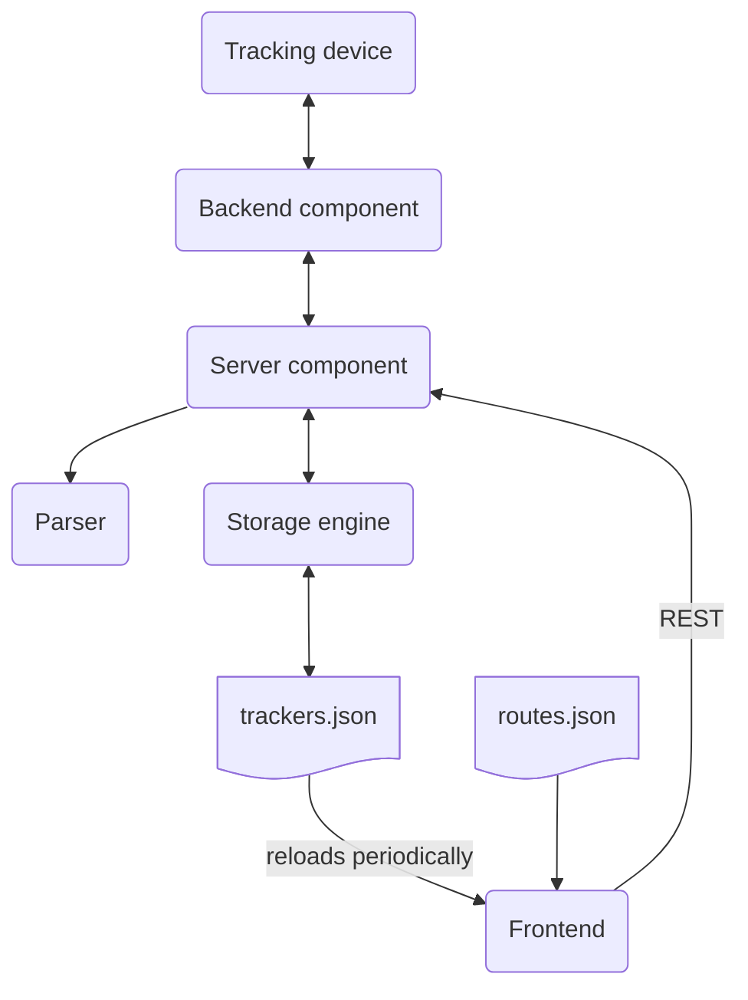

# Technical Documentation

## Overview
The SMS Live Tracker application provides real-time tracking. It uses MapLibre GL for mapping visualization and Hono for backend services.

## Architecture

### High-Level Components
1. **Frontend**
   - Uses MapLibre GL for map rendering
   - Implements custom controls for:
     - Trackers management (`TrackersControl`)
     - Zoom to fit functionality (`ZoomToFitControl`)
     - Route analysis (`zoomtofit.ts`)

2. **Backend**
   - SMS parsing and processing (`src/parser/smstracker.ts`)
   - Data storage and retrieval (`src/store.ts`)
   - API gateway for SMS communication (`src/backend/smsgateapp/smsgateapp.ts`)

3. **Data Flow**
```
SMS Message -> Parser -> Tracker Data -> Map Display
```

## Key Components

### 1. Data Storage
- **Store**: `src/store.ts`
  - Manages tracker data in JSON format
  - Handles synchronization of tracking data

### 2. Map Controls
- **Trackers Control**: `src/control/trackers.ts`
  - Manages display of tracker information
  - Implements POI (Point of Interest) detection
  - Shows route progress and estimated time to next POI

- **Interval Control**: `src/control/interval.ts`
  - Manages route interval markers
  - Creates evenly spaced points along routes for better tracking visualization
  - It is hidden from the UI

- **Style Switcher Control**: `src/control/styleswitcher.ts `
  - Allows switching between different map styles
  - Preserves source data while changing styles

- **Routes Control**: `src/control/routes.ts`
  - Manages route visualization and interaction
  - Implements checkbox controls for route visibility
  - Handles multi-line string geometries for complex routes

- **Export Control**: `src/control/export.ts`
  - Adds map export functionality
  - Supports PDF and image exports
  - Includes custom paper sizes (A0, A1)
  - Maintains printable area constraints during export

- **Zoom to Fit Control**: `src/control/zoomtofit.ts`
  - Allows users to zoom the map to fit all relevant data points
  - Implements automatic bounds calculation for:
    - LineString geometries
    - MultiLineString geometries 
    - Point coordinates

### 3. Tracker location and updates
- Flexible layout for different implementations

Current implementations:

  - SMS based tracking devices
    - **Benefits**:
      - Lower battery consumption
      - Works in areas with no mobile internet
      - Cost-effective for occasional use
    - **Limitations**:
      - Real-time tracking not guaranteed
      - Latency between updates
    - **Message Delivery**: `src/backend/smsgateapp/smsgateapp.ts`
      - Integrates with external SMS gateway (https://sms-gate.app)
      - Requesting positions via SMS
      - Receiving SMS updates
      - Decrypting/Encrypting sensitive data
    - **Parser**: `src/parser/smstracker.ts`
      - Parses SMS messages containing location data (Lat/Lon) and battery status
      - Data: Lat/Lon coordinates and Battery percentage

## Data Format

The application uses GeoJSON format for both tracking and route data.

### Trackers Data (`trackers.json`)
- Contains information about tracker devices and their current status
- Each feature represents a single tracker with:
  - `type`: `"Feature"`
  - `geometry`: Current coordinates of the device
  - `properties`:
    - `name`: Tracker ID (visible in UI)
    - `number`: Telephone number (used for SMS backend)
    - multiple properties are updated dynamically (e.g. `battery`, `requested`, `received`, ...)

### Route Data (`routes.json`)
- Contains predefined routes and points of interest
- Each feature represents either:
  - A route with start and end coordinates
  - A point of interest (POI) with additional information
- Properties include:
  - `name`: Route or POI name
  - `color`: HEX color code for visualization
  - `isDestination`: Indicates if this is a destination point
  - `group`: Optional grouping identifier

## Data Flow



## Testing

### Unit Tests
- **Crypt Module**: `crypt.test.ts`
  - Tests encryption/decryption functionality
  - Verifies correct handling of API keys and iterations

- **SMS Parser**: `smstracker.test.ts`
  - Tests message parsing logic
  - Verifies coordinate extraction and battery status updates

## Deployment

### Docker Setup
```dockerfile
# Build Command
docker build -t sms-live-tracker .

# Run Command
docker run -p 8000:8000 --volume /app/data sms-live-tracker
```

### Configuration
- Environment Variables:
  - For sms-gate.app backend:
    - `API_AUTHENTICATION`: Required for SMS gateway authentication
    - `API_ENCRYPTION`: Encryption key for sensitive data
    - `API_MESSAGE`: Default message template

## API Endpoints

### Request Position
- **Endpoint**: `/api/request`
- **Method**: POST
- **Description**: Triggers position request via SMS

### Receive Updates
- **Endpoint**: `/api/receive`
- **Method**: POST
- **Description**: Processes incoming SMS updates

## Security Considerations

1. **Encryption**
   - Uses AES-256-CBC for data encryption
   - Implements PBKDF2-SHA1 for key derivation

2. **Authentication**
   - Integrates with SMS gateway's authentication system
   - Handles API keys securely

3. **Data Protection**
   - Sensitive data is encrypted both at rest and in transit

## Contributing

### Development Setup
```bash
# Clone repository
git clone https://github.com/escoand/sms-live-tracker.git
cd sms-live-tracker

# Install dependencies
deno install
deno task build
```

### Testing
```bash
deno test --allow-env
```