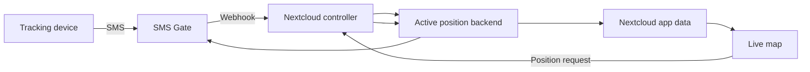

# Technical Documentation

## Overview

Live Tracker is a Nextcloud app. It uses MapLibre GL for visualization, Nextcloud app data for GeoJSON, and a configurable position backend. SMS Gate is the first backend.

## Architecture

### High-Level Components

1. **Frontend**
   - Uses MapLibre GL for map rendering
   - Implements custom controls for:
     - Trackers management (`TrackersControl`)
     - Zoom to fit functionality (`ZoomToFitControl`)
     - Route analysis (`zoomtofit.ts`)

2. **Backend**

- Nextcloud routes (`lib/Controller/PageController.php`)
- GeoJSON storage (`lib/Service/TrackerData.php`)
- Backend selection (`lib/Service/BackendRegistry.php`)
- SMS Gate integration (`lib/Service/SmsGateway.php`)

3. **Data Flow**


```mermaid
flowchart LR
  Device[Tracking device] -->|SMS| Gateway[SMS Gate]
  Gateway -->|Webhook| Controller[Nextcloud controller]
  Controller --> Backend[Active position backend]
  Backend --> Store[Nextcloud app data]
  Store --> Map[Live map]
  Map -->|Position request| Controller
  Controller --> Backend --> Gateway
```

## Key Components

### 1. Data Storage

- **Store**: `lib/Service/TrackerData.php`
  - Keeps trackers and routes as GeoJSON in Nextcloud app data
  - Accepts imports through the browser-based administrator settings

### 2. Map Controls

- **Trackers Control**: `src/control/trackers.ts`
  - Manages display of tracker information
  - Implements POI (Point of Interest) detection
  - Shows route progress and estimated time to next POI

- **Interval Control**: `src/control/interval.ts`
  - Manages route interval markers
  - Creates evenly spaced points along routes for better tracking visualization
  - It is hidden from the UI

- **Style Switcher Control**: `src/control/styleswitcher.ts `
  - Allows switching between different map styles
  - Preserves source data while changing styles

- **Routes Control**: `src/control/routes.ts`
  - Manages route visualization and interaction
  - Implements checkbox controls for route visibility
  - Handles multi-line string geometries for complex routes

- **Export Control**: `src/control/export.ts`
  - Adds map export functionality
  - Supports PDF and image exports
  - Includes custom paper sizes (A0, A1)
  - Maintains printable area constraints during export

- **Zoom to Fit Control**: `src/control/zoomtofit.ts`
  - Allows users to zoom the map to fit all relevant data points
  - Implements automatic bounds calculation for:
    - LineString geometries
    - MultiLineString geometries
    - Point coordinates

### 3. Tracker location and updates

- Flexible layout for different implementations

Current implementations:

- SMS based tracking devices
  - **Benefits**:
    - Lower battery consumption
    - Works in areas with no mobile internet
    - Cost-effective for occasional use
  - **Limitations**:
    - Real-time tracking not guaranteed
    - Latency between updates
  - **Message Delivery**: `lib/Service/SmsGateway.php`
    - Integrates with external SMS gateway (https://sms-gate.app)
    - Requesting positions via SMS
    - Receiving SMS updates
    - Decrypting/Encrypting sensitive data
  - **Parser**: `lib/Service/SmsGateway.php`
    - Parses SMS messages containing location data (Lat/Lon) and battery status
    - Data: Lat/Lon coordinates and Battery percentage

## Data Format

The application uses GeoJSON format for both tracking and route data.

### Trackers Data (`trackers.json`)

- Contains information about tracker devices and their current status
- Each feature represents a single tracker with:
  - `type`: `"Feature"`
  - `geometry`: Current coordinates of the device
  - `properties`:
    - `name`: Tracker ID (visible in UI)
    - `number`: Telephone number (used for SMS backend)
    - multiple properties are updated dynamically (e.g. `battery`, `requested`, `received`, ...)

### Route Data (`routes.json`)

- Contains predefined routes and points of interest
- Each feature represents either:
  - A route with start and end coordinates
  - A point of interest (POI) with additional information
- Properties include:
  - `name`: Route or POI name
  - `color`: HEX color code for visualization
  - `isDestination`: Indicates if this is a destination point
  - `group`: Optional grouping identifier

## Data Flow


```mermaid
flowchart LR
  Device[Tracking device] -->|SMS| Gateway[SMS Gate]
  Gateway -->|Webhook| Controller[Nextcloud controller]
  Controller --> Backend[Active position backend]
  Backend --> Store[Nextcloud app data]
  Store --> Map[Live map]
  Map -->|Position request| Controller
  Controller --> Backend --> Gateway
```

## Testing

### Backend Tests

- `test/tracker-data.test.php` checks GeoJSON validation.
- `test/appinfo.php` checks required app metadata and validates it against the
  installed Nextcloud schema when available.

## Deployment

Install the app in `custom_apps/live_tracker` and enable it in Nextcloud. Ensure
that directory contains `appinfo/`, `lib/`, `templates/`, `css/`, and `js/`.
Build the frontend with `deno task build` and include the generated
`js/index.js`, `js/index.css`, and `js/maplibre-gl-worker.js` in the app package.
Nextcloud cannot load the map without these three assets.

### GitHub Release

The GitHub Actions workflow builds the frontend, validates the PHP app, and
uploads `live_tracker.zip` as a workflow artifact. To publish a release, set the
version in `appinfo/info.xml`, push the matching `v<version>` tag (for example,
`v1.2.0`), and the workflow attaches the ZIP to the GitHub Release. The ZIP
contains a top-level `live_tracker/` directory for extraction into
`custom_apps/`.

To migrate an existing installation, import its GeoJSON tracker and route
collections through the Live Tracker administrator settings. Enter the SMS Gate
authentication, encryption passphrase, and position request message there,
then register the displayed webhook URL with SMS Gate. Nothing needs editing
in a configuration file.

### Configuration

- Choose a backend and enter its credentials in **Administration settings >
  Additional settings > Live Tracker**. No server configuration files need editing.

## API Endpoints

### Request Position

- **Endpoint**: authenticated Nextcloud `live_tracker.page.request` route
- **Method**: POST
- **Description**: Triggers position request via SMS

### Receive Updates

- **Endpoint**: token-protected `live_tracker.page.receive` route
- **Method**: POST
- **Description**: Processes incoming SMS updates

## Security Considerations

1. **Encryption**
   - Uses AES-256-CBC for data encryption
   - Implements PBKDF2-SHA1 for key derivation

2. **Authentication**
   - Integrates with SMS gateway's authentication system
   - Handles API keys securely

3. **Data Protection**
   - Tracker GeoJSON is stored in private Nextcloud app data, not public assets.
     Protect the Nextcloud database, app data, and backups accordingly.

### Development Setup

Install Node.js and Deno 2 or newer for the frontend asset build. The app's
HTTP API, storage, and SMS backend run inside Nextcloud; no separate server is
started.

```bash
# Clone repository
git clone https://github.com/escoand/sms-live-tracker.git
cd sms-live-tracker

# Install frontend dependencies
npm ci

# Build the map and worker bundles
deno task build
```

Run `npm test` with PHP 8.1+ and the DOM extension available. For a local
Nextcloud schema check, run `php test/appinfo.php` inside the Nextcloud container.
